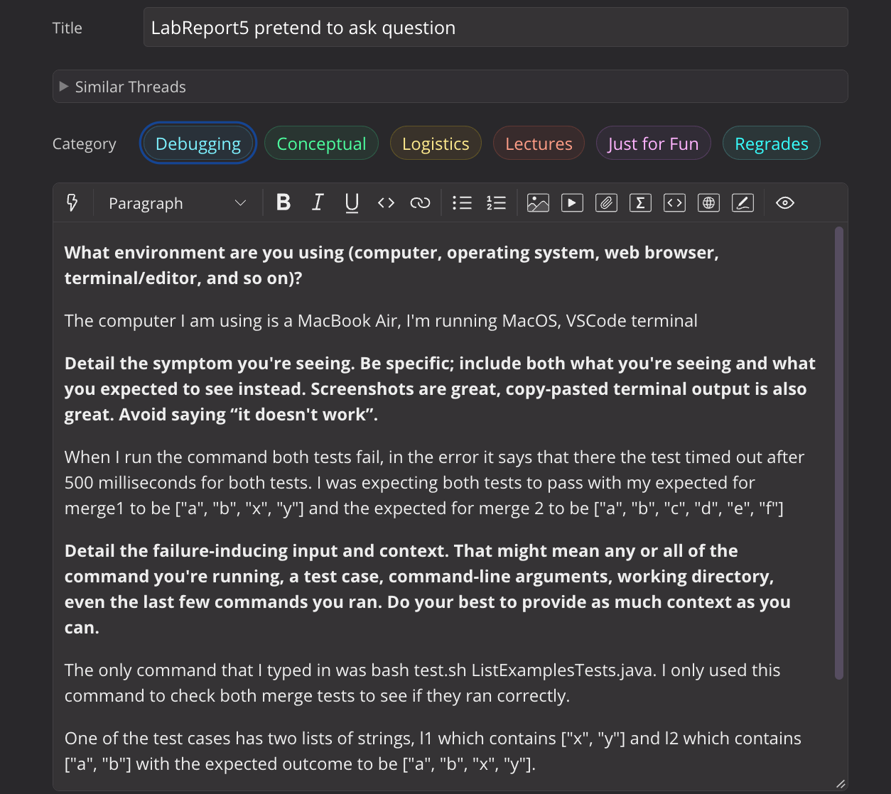
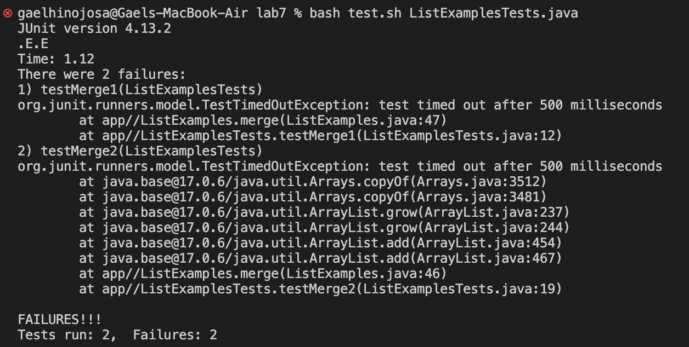
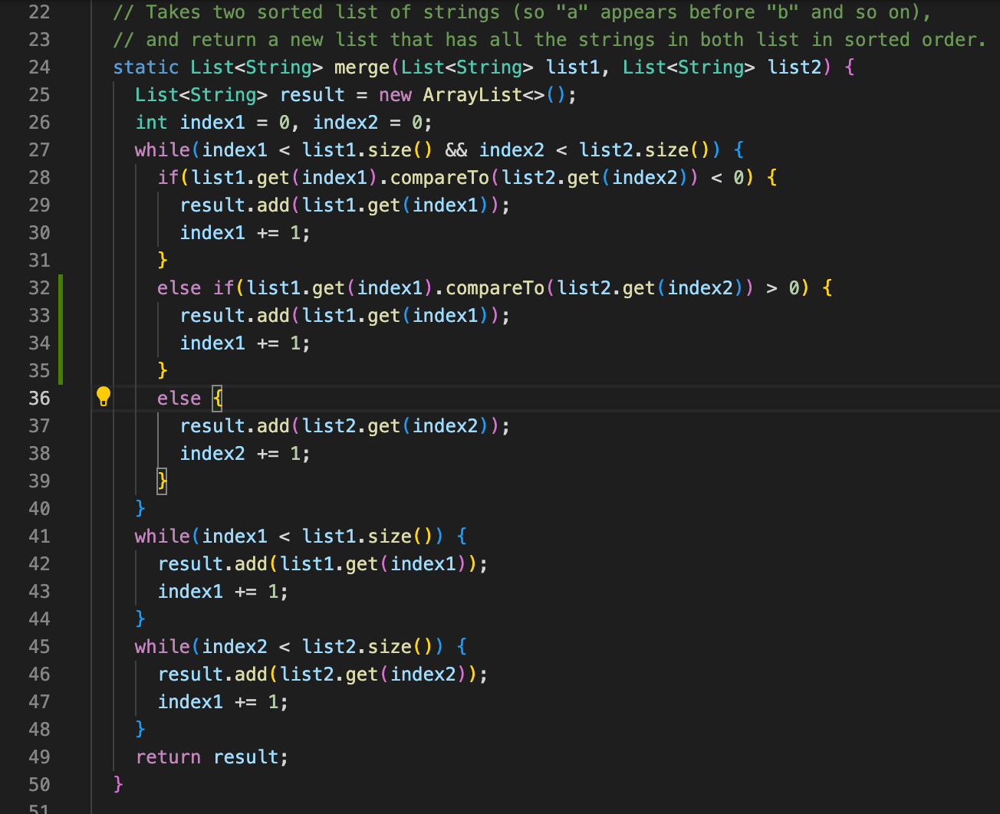
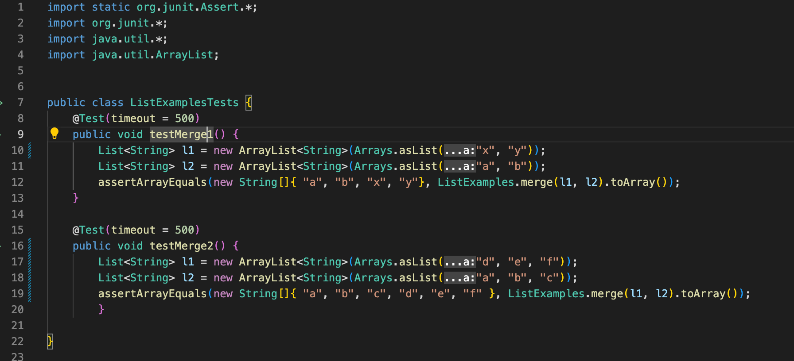
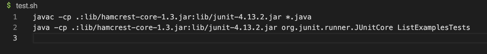
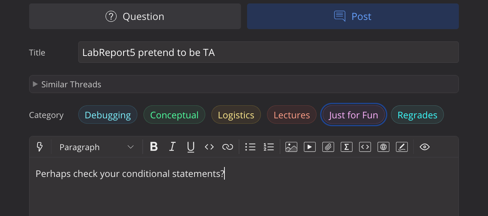
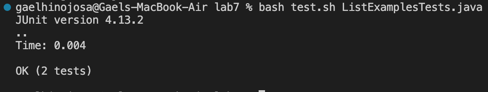
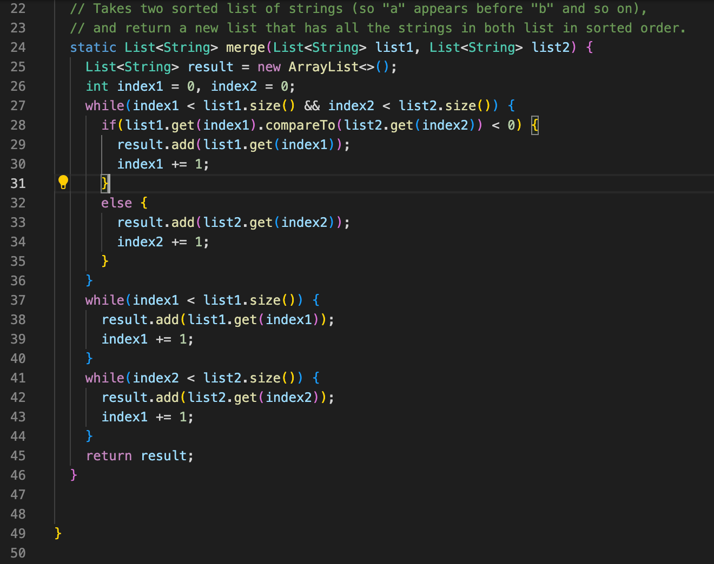

# Lab Report 5

## Part 1 - Debugging Scenario

1. Below is the screenshot of me asking a question about the error along with context about what each file contains before the bug was fixed



This screenshot is that of the error that occurred when trying to test ListExamplesTests.java along with the other files prior to fixing the bug

Here is the command I used to display the bug `bash test.sh ListExamplesTests.java`
|


This screenshot is ListExamples.java before fixing the bug

|
|


This screenshot is ListExamplesTests.java before fixing the bug

|
|


This screenshot is test.sh before fixing the bug

|
|


2. Here is the screenshot of me mimicking what it is to be a TA by giving a hint to myself by saying to check for the conditional statements in ListExamples.java

|
|


3. The screenshot below is what happened when the student used the information they got from the TA to fixing the bug and this is the result of that along with each file after the bug was fixed.

|
|

Here is a screenshot of ListExamples.java after the bug was fixed (The bug was found here).

The bug was found to be the second conditional statement in the merge method of the first while loop. Here is the code of it.
```
else if(list1.get(index1).compareTo(list2.get(index2)) > 0) {
        result.add(list1.get(index1));
        index1 += 1;
      }
```
This piece code from the merge method was essentially adding the same element from list1 twice which had VSCode struggle trying to use the tests in ListExamplesTests.java and ended up having the error of the test timing out after 500 milliseconds.

Here is the command I used to display the corrected test `bash test.sh ListExamplesTests.java`
|


Here is the screenshot of ListExamplesTests.java after the bug was fixed (There was no bug here so nothing had changed).

|
|


Here is the screenshot of test.sh after the bug was fixed (There wasn't any bug here either so nothing had changed).


## Part 2 - Reflection

I think the coolest thing I learned from the second half of the quarter was learning about Vim. It was fun going through and learning all the different ways to use it for my lab and lab reports. Another thing that happened during the second half of the quarter was that I received help from my lab partners during one of the labs where we had just learned about how to use if statements in a .sh file so that was cool that happened.
